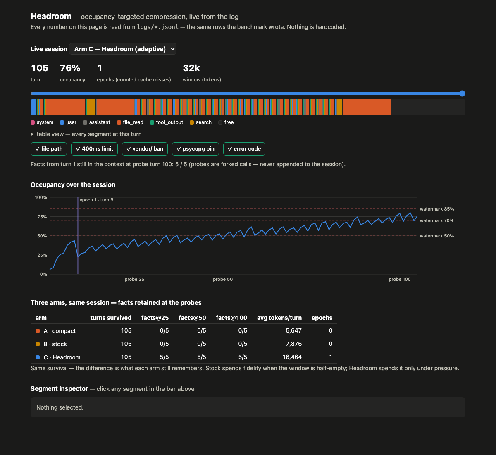

# Headroom

[](https://github.com/Paritok-official/paritok-4b-v1)

**Your agent stops forgetting what you asked for.**

Headroom is an OpenAI-compatible proxy that keeps an agent's context window from
filling up, so long sessions never hit the compaction cliff — the moment your
tool says *"compacting conversation…"* and summarizes away the bug description
and the constraint you gave at turn 3.

Point any OpenAI-compatible agent at it with one `BASE_URL` change. While
there's room, it touches nothing. As pressure builds, it compresses the oldest,
least important segments through [Paritok](https://github.com/Paritok-official/paritok-4b-v1)
— lightly first, harder only as needed. The system prompt, pinned constraints,
and the last two turns stay byte-identical, always.

## The claim, and the measurement

> Occupancy-targeted compression reaches the same session length as uniform
> aggressive compression, while retaining materially more of the early session.

Three arms, one scripted 105-turn debugging session, five facts planted
mid-briefing in turns 1–3, forked probes at turns 25/50/100, exact-substring
scoring (no LLM grader). One command: `.venv/bin/python benchmark/run.py`.
Upstream is a real model — SleepyAI `laguna-s-2.1`, 326 live calls.

| Arm | Policy | Turns survived | Facts in context @25/50/100 | Model restated them @25/50/100 | Avg tokens/turn | Peak occupancy | Epochs |
|---|---|---|---|---|---|---|---|
| A | direct + compact-at-90% | 105 | 0/5 · 0/5 · 0/5 | 0/5 · 0/5 · 0/5 | 5,647 | 88.6% | — |
| B | stock Paritok policy (tool L1 / history L3) | 105 | 0/5 · 0/5 · 0/5 | 0/5 · 0/5 · 0/5 | 7,876 | 43.9% | — |
| C | **Headroom** | 105 | **5/5 · 5/5 · 5/5** | **2/5 · 3/5 · 4/5** | 16,464 | 79.6% | **1** |

Same survival — the difference is what each arm still remembers. The second
scoring column is the strict one: a forked call asking the live model to restate
the constraints, graded on its actual reply. Headroom is the only arm that scores
on it at all, and it is honestly short of 5/5 — holding a fact in context does not
guarantee the model uses it.

Note what Headroom does **not** win: tokens. It sends ~2.9× Arm A and ~2.1× Arm B
per turn, and this table does not claim otherwise. The number that indicts fixed
policy is Arm B's **43.9% peak occupancy** — it destroyed all five facts while
leaving more than half the window unused. It compressed hard when nothing was
pressing. Full details and verdict: [`results/checkpoint1.md`](results/checkpoint1.md).

> **Disclosure:** a real Paritok key was supplied and probed. The hosted GPU is
> down — it returns HTTP 200 with `gpu_available: false` and your text echoed back
> unchanged at every level. Headroom detects this and falls back to its own
> deterministic compressor, stamping `compressor=local-fallback` on every affected
> log row. **No number above is attributed to Paritok.**
>
> We also pulled Paritok's open 4B model, which their passthrough message
> recommends self-hosting, and confirmed off it that `level` *is* honored —
> 32% / 24% / 19% for L1/L2/L3 on a small input. We deliberately did **not** run
> the benchmark on it: on realistic input it goes non-monotonic (L1 returns 100%
> of the input after 84s; L2 collapses to 9 tokens, losing every identifier), and
> more importantly it is our own prompt template against their weights rather than
> their `paritok proxy` — so its numbers are not Paritok's performance and won't
> be reported as if they were. See [`results/checkpoint0.md`](results/checkpoint0.md).



## Try it in 60 seconds (no account, no keys)

```bash
open examples/demo.html          # the dashboard with a real recorded run inlined
```

Or serve it live:

```bash
uv venv -p 3.12 .venv && uv pip install -p .venv/bin/python fastapi uvicorn httpx tiktoken
.venv/bin/python benchmark/run.py                      # ~2s offline, writes logs/
HEADROOM_LOG=logs/benchmark.jsonl PYTHONPATH=src \
  .venv/bin/python -m uvicorn headroom_proxy.app:app --port 8791
open http://localhost:8791/
```

Point an agent at it:

```bash
export OPENAI_BASE_URL=http://127.0.0.1:8791/v1
# optional headers: X-Headroom-Arm: adaptive|stock|compact|off · X-Headroom-Session: <id>
```

With real keys (activates hosted paths, zero code changes):

```bash
export PARITOK_API_KEY=pk_live_…     # hosted GPU compression
export SLEEPY_AI_API_KEY=sk-…        # SleepyAI as the task model
```

## How it works

Every message is classified on arrival (system / user / assistant / file read /
tool output / search) and kept **in original form forever**. Each turn:

1. **Measure occupancy** against the window ceiling (`HEADROOM_WINDOW`, default 32k).
2. **Under the low watermark?** Change nothing. Most turns land here.
3. **Crossed a watermark (50/70/85%)?** Re-plan the layout: lowest-priority
   classes exhaust their compression ladders (L0→L3) *before* a higher class
   loses a byte. Pinned content is skipped unconditionally. A re-plan that
   changes levels is an **epoch** — a deliberate, counted cache miss (the run
   above needed exactly one).
4. **Re-compress only what changed**, always from the original, never from an
   already-compressed version.

Between epochs the rendered prefix is byte-stable, so prompt caching behaves as
if the proxy weren't there. New arrivals under pressure adopt their class's
prevailing level at the tail — an append, not a prefix rewrite.

## Honest limitations

- This run used the **local deterministic fallback compressor** — no Paritok
  key was available at build time; unauthenticated calls get 401 + passthrough
  (verified live, see [`results/checkpoint0.md`](results/checkpoint0.md)).
  Every log row names its `compressor` backend. Hosted L3 is a learned
  summarizer and may retain more than the fallback — Arm B's 0/5 could improve
  with a key; Arm C's 5/5 doesn't depend on the compressor because its early
  user turns are never compressed at all.
- The upstream was the offline mock (`usage` flagged `estimated`,
  `tiktoken/cl100k_base` stamped in every row). One task, one seed — a
  demonstration, not a general law.
- Retention is measured as exact-substring presence of five planted facts in
  the sent context — what the model *could* see, not what it would repeat.
- Prompt caching already discounts stable prefixes; Headroom's argument is
  about window **capacity**, which caching doesn't help with at all.
- Streaming, accounts, persistence across restarts: out of scope by design.

## Repository map

`src/headroom_proxy/` proxy, controller, segment store, compressors, log ·
`benchmark/` corpus with pre-registered facts + three-arm runner ·
`dashboard/` single-file UI reading only from the log ·
`examples/` saved run + self-contained demo · `results/` per-step reports and
both checkpoint verdicts · `tests/` milestone invariants.

## License

Apache 2.0. Built with [Paritok](https://github.com/Paritok-official/paritok-4b-v1).
